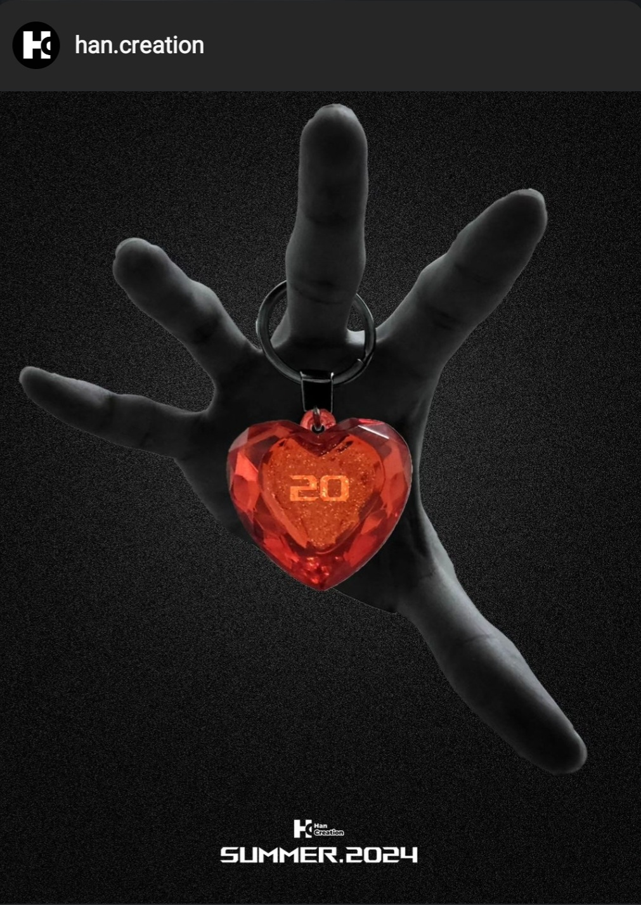

# The 20th Summer Project

This project is collections of mini-projects and my learning notes created by Han in Summer 2024, marks my 20th Summer in my life.

    

The poster can be found on instagram: [@Han.Creation](https://www.instagram.com/han.creation/)

## [Micrograd](https://github.com/HanCreation/micrograd)
This project is about trying to learn and build micrograd from scratch which is a basically a mini automatic gradient engine which implements a backpropagation. Also, implementing the micrograd engine to Neural Network (MLP)

Micrograd library originally created by Karpathy, et al.

## [Digit-MNIST Recognizer from Scratch](https://github.com/HanCreation/ScratchNN_DigitMNIST)
Learn to build a simple neural network from scratch using only NumPy and Math, without relying on any high-level libraries like TensorFlow, PyTorch, or Keras. The task was to classify digits from the MNIST dataset, which contains images of handwritten digits. Also, added another variant of creating the same based on torch basic library.

---
Edited, Noted, Coded; 

Anything Created by Han 2024

